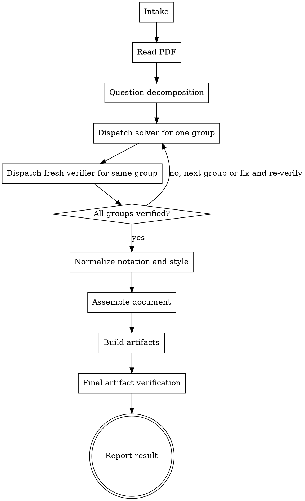

# Homework Solver

Turn a homework PDF into a solved answer document with verified mathematics and verified output artifacts.

**Core principle:** treat homework completion as a gated controller workflow: read first, solve one question group, verify that same group with a fresh verifier, pass the question gate, then assemble, build, and verify the final artifacts.

Default mode unless the user says otherwise:

- language: English
- style: detailed
- output: `.tex` and compiled `.pdf`
- subset: all questions

## When to Use

Use this skill when the user wants any of the following from a homework PDF:

- full worked solutions
- selected-question solutions
- a LaTeX answer sheet
- a compiled PDF answer sheet
- clean redraws of assignment figures

Do not use this skill for essays or research-writing tasks where outside sources are the main work.

## Non-Negotiables

- Read the PDF before solving.
- If text, formulas, or figures are unreadable, stop and ask. Never guess missing prompt content.
- If the user says to finish or complete the homework, treat that as a deliverable request, not chat-only help.
- Unless the user explicitly opts out, the default deliverable is a written answer document plus files: `.tex` and compiled `.pdf`.
- Do not stop at a chat-only answer when file generation is still expected by default.
- Use deterministic filenames.
- If multiple questions are requested, decompose by question or tightly coupled question group.
- Every included question group must go through a distinct solver phase and a distinct verifier phase. If subagents exist, use a fresh `solver` subagent and a separate fresh `verifier` subagent.
- With subagents available, each included question group must follow this exact sequence before moving on: `dispatch solver -> collect solver output -> dispatch fresh verifier for the same group -> resolve verifier notes -> pass question gate`.
- Do not solve all groups first and verify them later in a batch. Per-group solve-then-verify is required.
- Do not assemble any question until it has passed the question gate.
- Do not treat successful compilation as mathematical verification.
- Do not claim completion before both per-question verification and final artifact verification are done.

## Portability

This skill is designed to work as a standalone GitHub skill.

- Do not assume any other custom skills are installed.
- The only companion skill this skill may invoke is `pdf`.
- Do not invoke any other skill while following this workflow.
- If a separate `pdf` skill exists, use it. Otherwise, use the platform's native PDF-reading tools.
- If subagents are available, use the solver/verifier split described here. If subagents are not available, the main agent must still run a distinct solver phase and a distinct verifier phase before assembly.

## Workflow Model

This skill uses a strict separation-of-roles workflow:

- the `controller` owns intake, decomposition, dispatch, gating, normalization, build choice, and final reporting
- one `solver` handles one question group
- one fresh `verifier` independently checks that same question group
- the `assembler` role writes the final document using only approved question groups
- final verification happens only after build artifacts exist

If your platform does not support subagents, emulate the same workflow sequentially:

1. solve one question group
2. perform a separate verification pass using the verifier checklist
3. only then allow that question into the final document

The controller is never allowed to treat solver output as already trusted work.

## Execution Flow

## Step 1. Intake

- Confirm the source PDF path if unclear.
- Determine full assignment vs subset.
- Determine requested output: `.tex`, `.pdf`, or both.
- Determine language and style. If unspecified, use defaults.
- Determine whether the assignment requires drawn figures, tables, or formatted pseudocode.

After intake and PDF read, announce the concrete deliverable plan.

If the user asked to complete the homework and did not narrow the format, proceed toward `.tex` and `.pdf` generation without waiting for a second prompt.

## Step 2. Read the Assignment

- Extract the question text before solving.
- If the PDF contains garbled or partial text, stop and ask.
- Record any required metadata such as student name, ID, email, course title, due date, or required formatting notes.

## Step 3. Decompose the Work

- Split independent questions into separate question groups.
- Keep tightly coupled multi-part questions together.
- The controller owns consistency across notation, assumptions, and presentation.

## Step 4. Solver Phase

If subagents are available, dispatch one fresh solver subagent per question group.

If subagents are not available, the controller performs this phase directly but must still produce the same structured output for later verification.

Use the `Solver Contract` below as the required output format.

## Step 4A. Subagent Contracts

When subagents are available, the controller must keep prompts narrow, role-specific, and self-contained.

Do not make a subagent infer its role from surrounding conversation. State the role, scope, required output format, and forbidden actions directly in the prompt.

### Solver Contract

Give each `solver` subagent only the context needed to solve one question group.

The controller must provide:

- question ids covered
- exact extracted prompt text, or a faithful prompt summary if extraction is noisy
- any required notation or assumptions already fixed by the controller
- the required solver return format below
- explicit constraints: solve only; do not verify; do not assemble; do not claim completion; do not answer questions outside the assigned group

The `solver` must return exactly these sections:

- `question ids covered`
- `extracted prompt summary`
- `assumptions or theorems used`
- `derivation or proof outline`
- `final answers`
- `figure requirements`
- `notation introduced`
- `uncertainty` or `needs manual review`

The `solver` is responsible for solving, not for granting trust.

Use section labels exactly as written above. Do not merge sections, rename them, or replace them with free-form prose.

If the solver omits a required section, adds assembly work, or blends verification into the answer, the controller must reject that output and re-dispatch.

### Verifier Contract

Give each `verifier` subagent only the context needed to verify the same question group.

The controller must provide:

- the same question ids
- the original prompt text, or a faithful prompt summary if extraction is noisy
- the full solver output for that question group
- the verifier checklist from this skill
- the required verifier return format below
- explicit constraints: verify only; do not re-solve the whole assignment; do not assemble; do not claim completion; do not ignore missing sections in the solver output

The `verifier` must return exactly these sections:

- `verdict` with one of: `APPROVED`, `APPROVED_WITH_NOTES`, `REJECTED`
- `findings by question group`
- `corrected result if needed`
- `residual uncertainty if any`

The `verifier` is responsible for independent checking, not for assembly or final reporting.

Use section labels exactly as written above. Do not collapse them into a narrative summary.

Inside `findings by question group`, cover the verifier checklist in this order:

- question interpretation
- derivation or proof correctness
- numerical or symbolic result correctness
- recurrence correctness, if applicable
- pseudocode consistency with the described algorithm, if applicable
- agreement between solver working and final answer
- agreement between any required figure and the stated conclusion
- missing cases, hidden assumptions, or unjustified steps

If the verifier returns a verdict without findings, changes scope, or silently approves malformed solver output, the controller must reject that output and re-dispatch.

## Step 4B. Verdict Handling

Treat verifier verdicts as workflow states, not suggestions.

**APPROVED:**

- the group may pass the question gate
- `corrected result if needed` should be empty or explicitly say none
- proceed to normalization only after the gate is satisfied

**APPROVED_WITH_NOTES:**

- the group does not pass the gate until the controller resolves the notes
- incorporate the notes into the answer or explicitly preserve the residual uncertainty
- if the notes imply a real mathematical error, send the group back through fix-and-re-verify instead of treating it as done

**REJECTED:**

- the group must not enter assembly
- send the group back through fix-and-re-verify
- do not downgrade `REJECTED` to a note just to keep moving

### Controller Rules

The controller must treat subagent outputs as typed workflow artifacts, not casual notes.

- Do not paraphrase away missing sections.
- Do not let the verifier fix formatting gaps that belong to the solver.
- Do not let the assembler consume subagent output that failed the contract.
- If a subagent returns extra material outside its role, ignore it unless the controller explicitly re-dispatches for that purpose.

## Step 5. Verifier Phase

For every solver result, run a separate verifier phase for the same question group.

If subagents are available, dispatch a separate fresh verifier subagent.

If subagents are not available, the controller must perform an explicit second-pass verification against the checklist below before assembly.

The verifier must check:

- question interpretation
- proof or derivation correctness
- numerical or symbolic results
- recurrence correctness, if DP is involved
- pseudocode consistency with the described algorithm
- agreement between solver working and final answer
- agreement between any required figure and the stated conclusion
- missing cases, hidden assumptions, or unjustified steps

The verifier must return one of the verdicts defined in `Verdict Handling` below.

If the verifier returns `REJECTED`, do not assemble that question. Send it back through a fix-and-re-verify loop.

If the verifier returns `APPROVED_WITH_NOTES`, the controller must either:

- incorporate the notes into the answer before assembly, or
- explicitly preserve the residual uncertainty in the final document

Do not silently ignore verifier notes.

The verifier phase must be distinct from the solver phase. A quick reread of the same draft is not enough; use the checklist deliberately and record the result.

The controller must resolve verifier output for one group before dispatching assembly work that depends on that group.

## Step 6. Question Gate

No question may enter the final document until all of the following are true:

- the solver output exists
- the verifier output exists
- any verifier notes have been incorporated or explicitly preserved
- notation and assumptions are understood by the controller
- any residual uncertainty is explicit

Skipping this gate is a workflow violation.

## Step 7. Normalize Before Assembly

Before writing LaTeX, normalize across all approved question groups:

- notation and symbols
- theorem names and assumptions
- answer style and level of detail
- figure references and captions
- uncertainty markers
- pseudocode formatting

The main agent is responsible for this step. Do not make assembly a blind concatenation of subagent outputs.

## Step 8. Assemble the Document

- Put all requested questions into one answer document unless the user asks for separate files.
- Include the required header fields on page 1 if the assignment asks for them.
- Show enough derivation to be submit-ready.
- Prefer compact prose around formulas.
- Use TikZ or another clean reproducible method for figures that must be redrawn.
- Do not let the assembler invent, repair, or silently reinterpret mathematics. Assembly is for approved content only.

## Output Naming Rule

Use:

`<pdf-stem><subset-if-any>_solution<language-if-nondefault><style-if-nondefault>.<ext>`

Rules:

- subset format: `_q2_q5`
- nondefault language: `_cn` or `_bilingual`
- nondefault style: `_exam`
- default English detailed mode adds no suffix

Examples:

- `hw2.pdf` -> `hw2_solution.tex`, `hw2_solution.pdf`
- `hw2.pdf` with Q4 and Q5 -> `hw2_q4_q5_solution.tex`
- `hw2.pdf` bilingual exam brief -> `hw2_solution_bilingual_exam.tex`

Fallback only if the PDF stem is unavailable:

- `assignment_solution.tex`
- `assignment_solution.pdf`

## Build Workflow

### 1. Detect local environment first

- check for `latexmk`, `pdflatex`, and `xelatex`
- prefer an existing working engine over installation
- on Windows, assume MiKTeX may exist even if `latexmk` is unhealthy

### 2. Choose the cheapest working path

Preferred order:

1. existing direct engine with current document
2. simplified document plus existing direct engine
3. existing `latexmk` if healthy
4. installation or configuration only if no working engine exists

### 3. Build recovery for constrained environments

If the first build fails:

- if `latexmk` is blocked by MiKTeX state or update warnings, switch to direct `pdflatex -interaction=nonstopmode -halt-on-error <file.tex>`
- if the document genuinely needs broader Unicode or font support and `xelatex` is available, use direct `xelatex` instead of forcing extra packages into a `pdflatex` path
- if optional packages are missing, simplify the preamble first
- for plain homework answer sheets, a minimal preamble is usually enough: `article`, `geometry`, `amsmath`, `amssymb`
- distinguish warnings from fatal errors; a MiKTeX update reminder is not itself a failed build if the PDF was produced
- if noninteractive package installation blocks progress, simplify the document or report the exact missing package

### 4. Escalation Rule

- If no working TeX engine exists and setup requires intrusive machine changes, stop and report the blocker clearly.
- Still deliver the `.tex` file if `.pdf` compilation is blocked.

## Final Artifact Verification

Do this only after the output files exist.

Check this exact list:

- requested questions are present
- every included question passed the question gate
- requested language and style were applied
- notation is consistent across questions
- required figures are included and readable
- filenames follow the naming rule
- `.tex` exists
- `.pdf` exists if requested
- build completed without fatal errors
- any remaining uncertainty is explicitly marked

## Quick Reference

| Situation | Action |
|---|---|
| Full assignment PDF | Read, decompose, solve, verify, assemble, build, verify |
| Selected questions only | Keep subset in one document and encode it in filename |
| Many independent questions | Keep one-group-at-a-time `solve -> verify -> gate` sequencing; do not batch-solve or batch-verify |
| Unreadable PDF text or figure | Stop and ask |
| No custom PDF skill installed | Use native PDF extraction tools and continue |
| No subagent support | Run solver phase, then a separate verifier phase manually |
| Solver finished but no verifier yet | Do not assemble that question |
| Verifier rejects a question | Fix and re-verify before proceeding |
| Compilation succeeded | Continue to artifact verification; do not infer math correctness |
| No working TeX engine | Report blocker and still deliver `.tex` |

## Red Flags

- solving before reading the PDF
- treating the user request as chat-only when they asked to finish the homework
- treating `.tex` and `.pdf` generation as optional when the user asked to complete the homework and did not opt out
- parallelizing tightly coupled parts that need shared reasoning
- using a solver phase without a separate verifier phase
- solving all question groups first and verifying them later in a batch
- letting the same subagent both solve and verify the same question group
- skipping verification because the platform has no subagent feature
- assembling a document from unverified question outputs
- assuming compilation success means the answers are correct
- accepting inconsistent notation from subagents without normalization
- invoking unrelated skills during the homework workflow
- claiming completion after build verification but before question-level verification

## Common Mistakes

| Mistake | Fix |
|---|---|
| Solver output is copied directly into LaTeX | Run verifier first, then normalize before assembly |
| One question is verified but others are not | Keep per-question gates; verify every included question |
| All questions are solved first, then verified later | Enforce `solve -> verify -> gate` for each group before moving on |
| Build success is reported as overall success | Separate mathematical verification from artifact verification |
| Figures are mentioned but not drawn | Create the figure before final verification |
| Different questions use conflicting notation | Normalize centrally before assembly |
| Other installed skills get pulled in automatically | Restrict companion skills to `pdf` only |

## Invocation Pattern

When the user gives a homework PDF and wants a solved deliverable, use this skill first. Only `pdf` may be used alongside it. Follow the strict order: read the PDF, decompose the work, run `solve -> verify -> gate` for one group at a time, normalize, assemble, build, then perform final artifact verification.

If you skip a gate, you are not following this skill.
